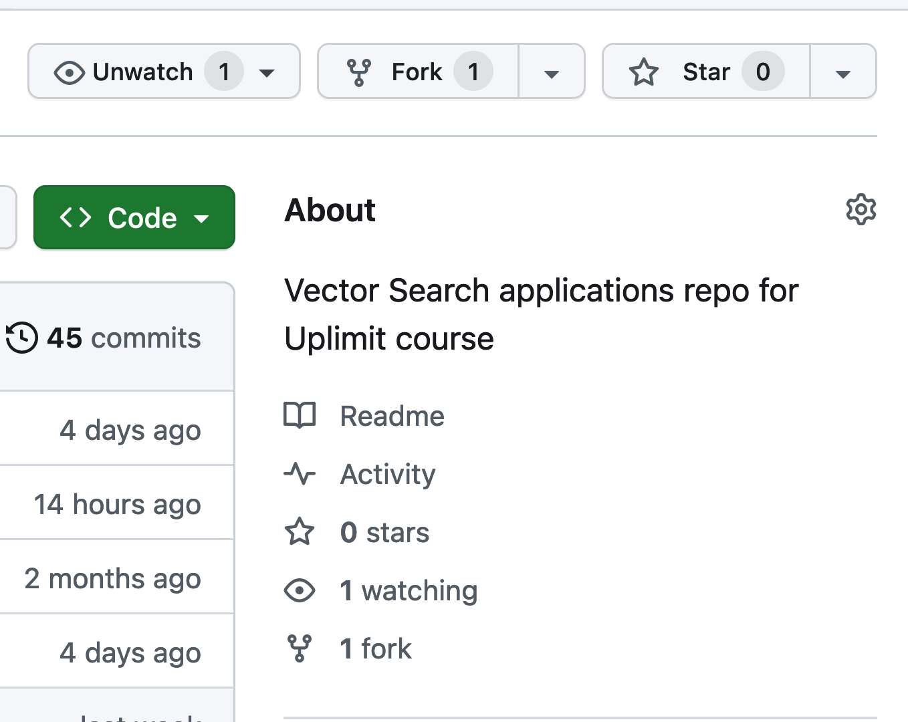

# Welcome to Vector Search Applications with LLMs
This is the course repository for Vector Search Applications with LLMs taught by [Chris Sanchez](https://www.linkedin.com/in/excellenceisahabit/) with assistance from [Matias Weber](https://www.linkedin.com/in/matiasweber/).
The course is desgined to teach search and discovery industry best practices culminating in a demo Retrieval Augmented Generation (RAG) application.  Along the way students will learn all of the components of a RAG system to include data preprocessing, embedding creation, vector database selection, indexing, retrieval systems, reranking, retrieval evaluation, question answering through an LLM and UI implementation through Streamlit.  

# Prerequisites - Technical Experience
Students are expected to have the following technical skills prior to enrolling. Students who do not meet these prerequisites will likely have an overly challenging learning experience:
- Minimum of 1-year experience coding in Python.  Skillsets should include programming using OOP, dictionary and list comprehensions, lambda functions, setting up virtual environments, comfortability with git version control.  
- Professional or academic experience working with search engines. 
- Ability to comfortably navigate the command line to include familiarity with docker. 
- Nice to have but not strictly required:
    - experience fine-tuning a ML model
    - familiarity with the Streamlit API
    - familiarity with making inference calls to a Generative LLM (OpenAI)  
# Prerequisites - Administrative
1. Students will need access to their own compute environment, whether locally or remote.  There are no hard requirements for RAM or CPU processing power, but in general the more punch the better. 
2. Students will need accounts with the following organizations:
    - Either an [OpenAI](https://openai.com) account **(RECOMMENDED)** or another LLM provider of their choice.  Students can choose to use an open source LLM if desired, however, the codebase is not currently optimized for open source LLM support.   
    - An account with [weaviate.io](https://weaviate.io).  The current iteration of this course will use Weaviate as a sparse and dense vector database.  Weaviate offers free cloud instance cluster resources for 14 days, with the option to extend the instance an additional 14 days (as of April 2024).
    - A standard [Github](https://github.com/) account in order to fork this repo, clone a copy, and submit commits to the fork if desired throughout the course. 

# Setup
1. Fork this course repo (see upper right hand corner of the repo web page).
    
3. Clone a copy of the forked repo into the dev environment of your choice.  Navigate into the cloned `vectorsearch-applications` directory. 
4. Create a virtual environment using your python library of choice.  Here's an example using [`conda`](https://docs.conda.io/projects/miniconda/en/latest/):  
```
conda create --name mynewenv -y python=3.10
```
4. Once the environment is created, activate the environment and install dependencies.
```
conda activate mynewenv

pip install -r requirements.txt
```
5. Last but not least create a `.env` text file in your cloned repo.  At a minimum, add the following environment variables:
```
OPENAI_API_KEY= "your OpenAI account API Key"
WEAVIATE_API_KEY= "your Weaviate cluster API Key"   <--- you will get this on Day One of the course
WEAVIATE_ENDPOINT= "your Weaviate cluster endpoint"  <--- you will get this on Day One of the course
```
6. If you've made it this far, you are ready to start the course.  Enjoy the process!

